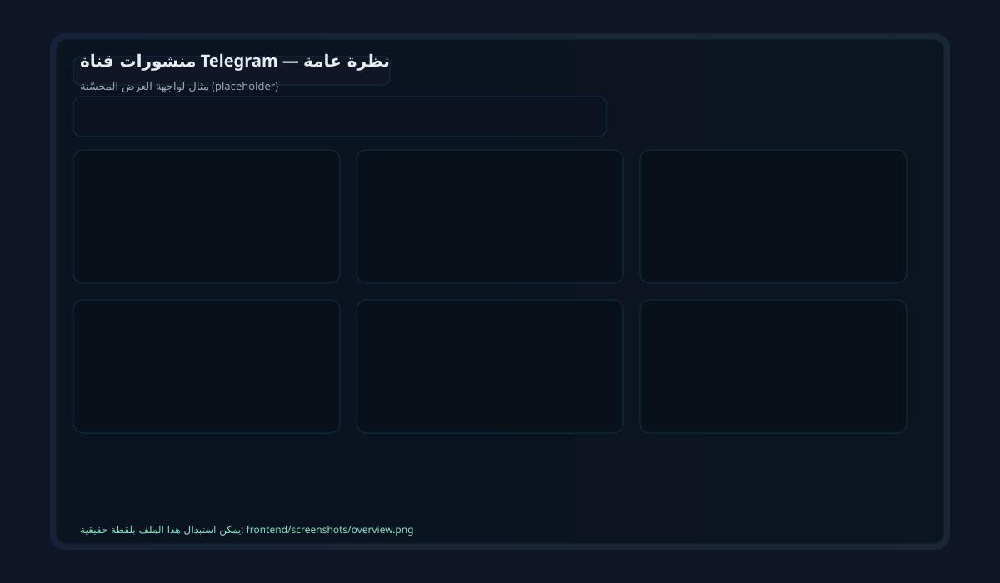
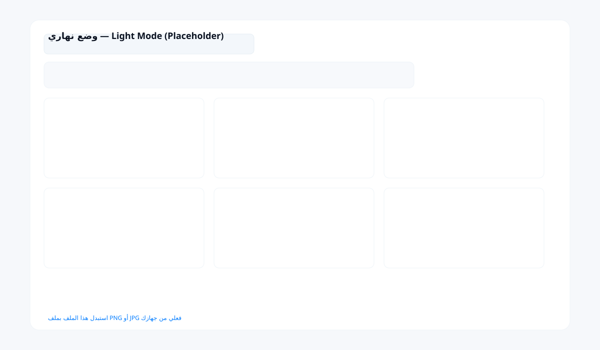
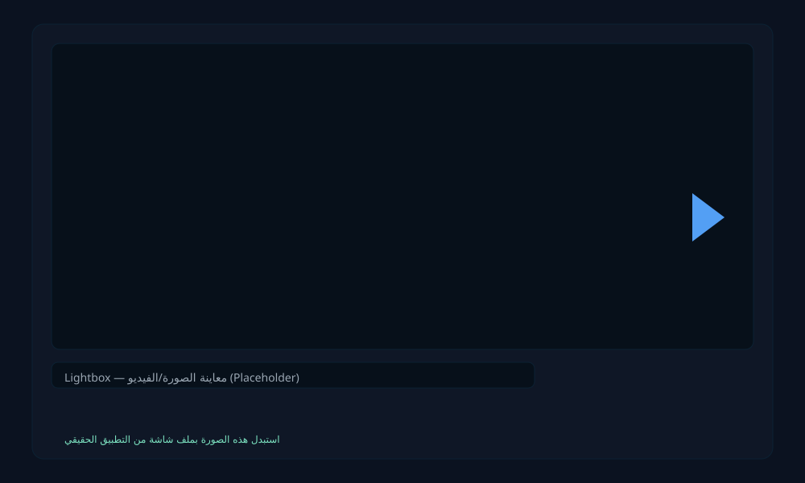

# Telegram Channel Posts Viewer

مشروع لعرض منشورات قناة Telegram على صفحة ويب (Frontend: Vanilla HTML/CSS/JS، Backend: Node.js + Express).

المحتوى
```
telegram-posts/
├── frontend/
│   ├── index.html
│   ├── style.css
│   └── app.js
├── backend/
│   ├── server.js
│   ├── package.json
│   └── .env.example
├── Dockerfile
├── docker-compose.yml
├── .gitignore
└── README.md
```

ملاحظة سريعة
- الواجهة الأمامية لا تحتوي على أي مفاتيح/معلومات حساسة — كل اتصالات Telegram تتم من الخادم عبر متغيرات البيئة في `.env`.
- لا ترفع `.env` إلى المستودع (موجود بالفعل في `.gitignore`).

ملخص الميزات (المضافات الأخيرة)
- عرض منشورات القناة (channel_post) مع دعم نصوص، صور، فيديو، ومستندات.
- بطاقات أنيقة ومتجاوبة مع تأثير hover وتحريك خفيف.
- تحميل تدريجي (Load more) + تخزين مؤقت محلي لعرض سريع.
- مؤشر حالة تحميل وSkeleton placeholders أثناء جلب البيانات.
- بحث فوري داخل المنشورات + فلترة حسب النطاق الزمني.
- Lightbox للوسائط (صور/فيديو) مع إغلاق بواسطة Esc أو النقر بالخارج.
- تح��يل كسول للصور/الفيديوهات عبر IntersectionObserver.
- وضع ليلي/نهاري قابل للتبديل مع ثيمات قابلة للإضافة.
- تحسينات وصول (aria attributes، RTL متوافقة).
- أمان: تعقيم نصوص الخادم + استخدام textContent في الواجهة لمنع XSS.
- حماية مفاتيح: كل المفاتيح في `.env` فقط، لا تسرب للـ frontend.
- Dockerfile + docker-compose لتشغيل سهل في بيئة حاويات.

لقطات شاشة (Screenshots)
- تم تضمين لقطات شاشة افتراضية (placeholders) داخل المجلد التالي:
  - frontend/screenshots/overview.svg
  - frontend/screenshots/light-mode.svg
  - frontend/screenshots/lightbox.svg

أمثلة إدراج:




لإستبدال الصور الافتراضية:
1. ضع الصور الحقيقية (PNG/JPG) داخل `frontend/screenshots/` مع الأسماء المذكورة أعلاه أو أسماء جديدة.
2. حدّث روابط الصور في README إن لاحظت أسماء مختلفة، أو اضف ملفات إضافية بنفس الصي��ة:
   ``
3. التزم بالأحجام المقترحة (مثلاً 1200×700) للحصول على مظهر جيد في README.

تشغيل محلي (بدون Docker)
1. انسخ/أنشئ `.env` في مجلد `backend` من `.env.example` واملأ:
   - `TELEGRAM_BOT_TOKEN` — توكن البوت (من BotFather).
   - (اختياري) `CHANNEL_USERNAME` — اسم المستخدم العام للقناة (بدون @) لروابط المنشورات.
2. ثبّت الاعتمادات:
   ```bash
   cd backend
   npm install
   ```
3. شغّل الخادم:
   ```bash
   npm start
   ```
   أو أثناء التطوير:
   ```bash
   npm run dev
   ```
4. افتح المتصفح:
   ```
   http://localhost:3000
   ```

تشغيل باستخدام Docker (موصى به للـ deployment)
1. انسخ `.env.example` إلى `.env` واملأ القيم.
2. قم ببناء الصورة وتشغيل الحاوية:
   ```bash
   docker-compose up --build -d
   ```
3. افتح:
   ```bash
   http://localhost:3000
   ```
4. لمشاهدة السجلات:
   ```bash
   docker-compose logs -f
   ```

ملاحظات حول Telegram
- لكي يتلقى البوت منشورات القناة (channel_post) يجب:
  1. إنشاء بوت عبر BotFather.
  2. إضافة البوت إلى القناة كـ Administrator (حتى يتلقى تحديثات).
- قيود مهمة:
  - Bot API لا يوفّر طريقة مباشرة لاسترجاع تاريخ القناة القديم قبل إضافة البوت. لاستيراد تاريخ قديم يلزم استخدام MTProto أو تصدير القناة.
  - عملية جلب ملفات الوسائط تستدعي endpoint `getFile` ثم الوصول إلى `https://api.telegram.org/file/bot<TOKEN>/<file_path>`. للمشاريع الكبيرة اجعل هذه الروابط مخزّنة مؤقتًا (caching) أو استخدم CDN.

أمن وحماية
- لا تضع TELEGRAM_BOT_TOKEN في الواجهة الأمامية.
- أضف `.env` إلى `.gitignore` (موجود بالفعل).
- الخادم يقوم بتعقيم (escape) النصوص؛ الواجهة تستخدم textContent لتفادي XSS.
- إذا نشرت الخدمة على الإنترنت:
  - ضعها خلف reverse proxy (مثل Nginx) مع HTTPS.
  - استخدم secrets/variables الخاصة بالمنصة مستضيفًا (Heroku, DigitalOcean App Platform, GitHub Actions secrets، إلخ).
  - حدد قواعد CORS ملائمة إن لزم.

تخزين مؤقت (Caching)
- الخادم يخز�� منشورات في `backend/cache.json` (قابل للـ volume في Docker) للحفاظ على البيانات بين إعادة التشغيل.
- الواجهة الأمامية تخزن آخر استجابة مؤقتًا في `localStorage` لعرض سريع.

اقتراحات تطوير مستقبلية (قابلة للتنفيذ بسهولة)
- استبدال Polling بـ Webhook لتقليل التأخير والمكالمات، أو استخدام Server-Sent Events / WebSocket لإشعار الـ frontend بالمنشورات الجديدة فور ورودها.
- إضافة قاعدة بيانات (SQLite/Postgres) بدلاً من ملف `cache.json` لإنشاء فلترة/بحث أسرع وتخزين طويل الأمد.
- تحسين تخزين وسائط الملفات (cache file_path) لتقليل استدعاءات `getFile`.
- تمكين مصادقة للمشرفين لميزات إدارية (حذف/تثبيت منشورات محلياً).
- إضافة اختبارات وحدات ووظائف E2E.

حل مشاكل شائعة
- لا تظهر المنشورات:
  - تأكد من أن البوت مضاف كـ Admin في القناة.
  - تأكد من أن التوكن صحيح في `.env`.
  - افتح سجلات الخادم وابحث عن أخطاء الاتصال بالـ Telegram API.
- الص��ر/الفيديو لا تُحمّل:
  - قد تكون روابط ملفات Telegram قديمة أو لم يتم الحصول على `file_path` بنجاح.
  - راجع سجل الخطأ للخادم للتحقق من أخطاء `getFile`.
- تغييرات الواجهة لا تظهر:
  - تأكد أنك استبدلت ملفات داخل `frontend/` وأعد تحميل الصفحة (أحيانًا تحتاج لمسح الكاش).

إضافة لقطات شاشة إلى README (خطوات سريعة)
1. افتح التطبيق محليًا.
2. التقط لقطات شاشة للعناصر المهمة (لوحة العرض، lightbox، بحث/فلترة).
3. ضع الصور في `frontend/screenshots/`.
4. أضفهم للـ README بصيغة:
   ```markdown
   
   ```

الملفات ذات الصلة للتعديل السريع
- واجهة: `frontend/index.html`, `frontend/style.css`, `frontend/app.js`
- خادم: `backend/server.js`
- إعدادات: `backend/.env.example`, `Dockerfile`, `docker-compose.yml`

خاتمة
هذا المستودع الآن يحتوي على واجهة محسّنة وتجربة مستخدم أفضل، مع كل نصائح التشغيل والأمن. إذا أردت أستطيع الآن:
- 1) إدراج لقطات شاشة افتراضية (أنا لا أملك صور حقيقية لكن أضع روابط/نماذج)،
- 2) أوتوماتيكياً إنشاء commit في مستودع GitHub الخاص بك مع تحديث README (أحتاج إذن repo/owner)،
- 3) إضافة ثيمات جاهزة (مثلاً: "solar", "midnight", "sepia") مع زر لتبديل قائمة الثيمات،
- 4) أو توليد ملف `docker-compose.dev.yml` يمكّن التطوير (nodemon + mounts).

أي خيار تفضّل أن أنفذه الآن؟
